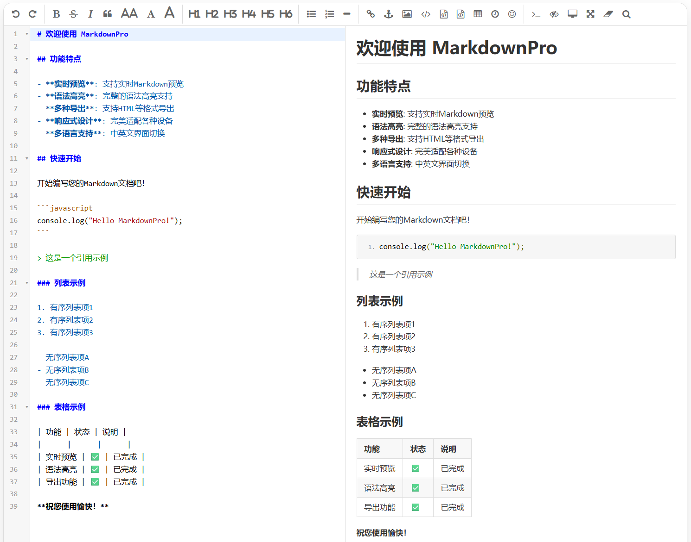

# MdEditor

一个网页 Markdown 编辑器（Vue 3 + TypeScript）。
目前的大致目标是


**项目阶段**：

- [x] Step 0 : Markdown ↔ HTML 双向转换器
- [ ] Step 1 : 搭建页面雏形
- [ ] ...

## 🚀 快速开始

```bash
pnpm install
pnpm run dev        # 开发服务器
pnpm run build      # 生产构建
pnpm run type-check # 类型检查
pnpm run lint       # 代码检查
```

---

📚 Vue 3 学习项目
